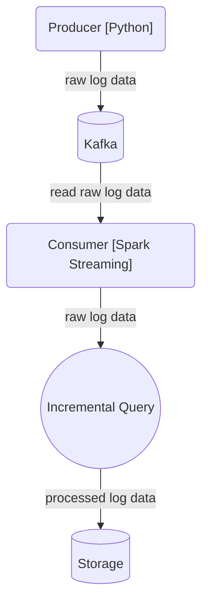

# Example of Spark Streaming Application with Apache Kafka

# Installation
## Kafka
```sh
# Firstly we should download Apache Kafka
$ wget https://dlcdn.apache.org/kafka/3.8.0/kafka_2.13-3.8.0.tgz

# Extract it after download.
$ tar -xzf kafka_2.13-3.8.0.tgz
$ cd kafka_2.13-3.8.0

# Start the ZooKeeper service
$ bin/zookeeper-server-start.sh config/zookeeper.properties

# Start the Kafka service
$ bin/kafka-server-start.sh config/server.properties

# Create a topic to store events
$ bin/kafka-topics.sh --create --topic <TOPIC_NAME> --bootstrap-server localhost:9092

# You can check the created topic
$ bin/kafka-topics.sh --describe --topic <TOPIC_NAME> --bootstrap-server localhost:9092

# If you want to delete the topic
$ bin/kafka-topics.sh --delete --topic <TOPIC_NAME> --bootstrap-server localhost:9092
```

## Consumer
```
$ chmod +x ./scripts/run_task.sh
$ ./scripts/run_task.sh
```

## Producer
```sh
$ virtualenv venv
$ source ./venv/bin/activate
$ pip install -r requirements.txt
$ python entrypoint.py <TOPIC_NAME>
```

# Diagram

